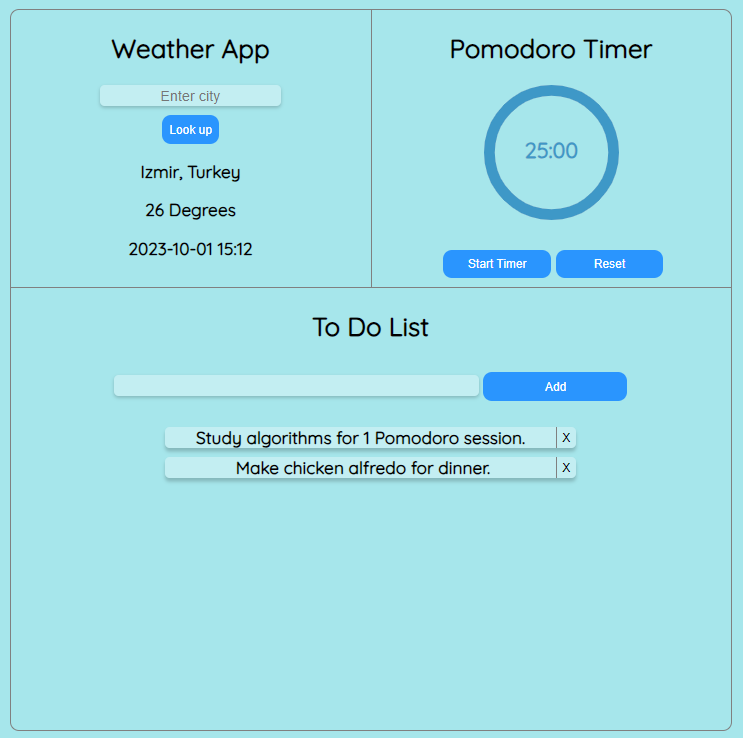

# Little Helper App
This React app is designed to help people study.

## Components
There are three main components in this app.
### Weather Component
The weather app uses an API to get the weather degree based on the location of your choosing.

### Pomodoro Timer
This timer is a basic pomodoro timer that can be started, stopped and reset. It has a circular progress bar which makes it more appealing.

### To Do List
You can add anything you want to add to this to do list. Maybe it's study subjects, chores or a movie to watch. You can add and delete any item as you wish.

